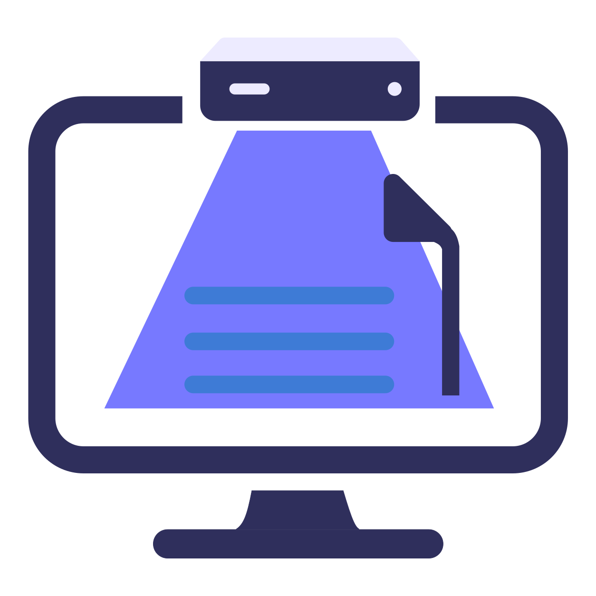

<div align="center">
  
  <h1>Desktop Scanner</h1>
  <p>Turn photos and PDFs of documents into clean, straightened, multi-page scans — on Windows, entirely offline.</p>
  <p>
    <a href="https://github.com/manasij123/desktop-scanner/releases/latest"><b>⬇ Download for Windows</b></a>
    &nbsp;·&nbsp;
    <a href="https://manasij123.github.io/desktop-scanner/">Website</a>
  </p>
</div>

---

## What it does

- **Finds the page for you** — an ML segmentation model (rembg / u2netp) plus classic edge and brightness detection locate the document, even on a cluttered desk, and reject a photo that has no document in it.
- **Fixes the angle** — four draggable corners + a perspective warp flatten a page shot from any angle into a straight-on rectangle.
- **Four scan looks** — Original, Photo, Docs, Clear — each in colour or black & white. Docs / Clear flatten shadows, neutralise the paper tint, and push text to crisp black.
- **Sharpen soft text** — optional "Sharpen" toggle: a Lanczos upscale + two-scale unsharp that crisps up text photographed a little too soft or small. Sharpens what's there, never hallucinates a character.
- **Recover faded text** — where glare or a bright reflection washed a stroke almost to white, re-ink it toward its true darkness — told apart from back-of-page show-through so bleed-through is left faint. Docs / Clear only.
- **Photos and PDFs, in bulk** — drag a stack of images or an existing PDF onto the window (or onto the app icon to launch it on them); set the crop and look once, every page follows.
- **Reads the text** — built-in OCR (Tesseract) in English and Bengali; copy it out or save as `.txt`.
- **One clean PDF out** — reorder / rotate / drop pages, then export a single A4 PDF, or print.

Everything runs locally. No account, no upload, no network required — the model weights and language data ship inside the app.

## Install

Download the latest `DesktopScanner-Setup-*.exe` from the [Releases page](https://github.com/manasij123/desktop-scanner/releases/latest) and run it. It installs per-user (no administrator prompt) and adds a Start Menu shortcut.

> Windows may show *"Windows protected your PC"* because the installer isn't code-signed — click **More info → Run anyway**.

**Requirements:** Windows 10 or 11, 64-bit. ~640 MB on disk.

## Run from source

```bash
python -m venv venv
venv\Scripts\activate
pip install -r requirements.txt
python main.py
```

OCR additionally needs the [Tesseract engine](https://github.com/UB-Mannheim/tesseract) on `PATH` (or installed at its default Windows location). Language data for English + Bengali is bundled under `clearscanner/assets/tessdata/`.

## Project layout

| Path | What's there |
|---|---|
| `main.py` | App entry point — splash screen → main window |
| `scan.py` | Standalone CLI of the same pipeline |
| `clearscanner/core/` | Detection, perspective transform, filters, OCR, PDF import |
| `clearscanner/ui/` | PySide6 UI — main window, crop editor, page list, workers |
| `clearscanner/output/` | Multi-page PDF writer |
| `benchmark/` | Systematic quality-benchmark scripts (test images kept local) |
| `installer/` | Inno Setup script for the Windows installer |
| `docs/` | The download website (GitHub Pages) |

## Build the installer

```bash
venv\Scripts\pyinstaller "Desktop Scanner.spec"
"%LOCALAPPDATA%\Programs\Inno Setup 6\ISCC.exe" installer\DesktopScanner.iss
```

See [`DEPLOY.md`](DEPLOY.md) for the full release workflow. Tagged
releases (`vX.Y.Z`) are built on a GitHub Actions Windows runner from
this same spec — see [`.github/workflows/release.yml`](.github/workflows/release.yml).
Authenticode signing of the built `Desktop Scanner.exe` and the installer
via [SignPath.io](https://signpath.io) is being set up.

## Security & conduct

- [`SECURITY.md`](SECURITY.md) — how to report a vulnerability privately.
- [`CODE_OF_CONDUCT.md`](CODE_OF_CONDUCT.md) — Contributor Covenant 2.1.

## License

MIT — see [`LICENSE`](LICENSE).
